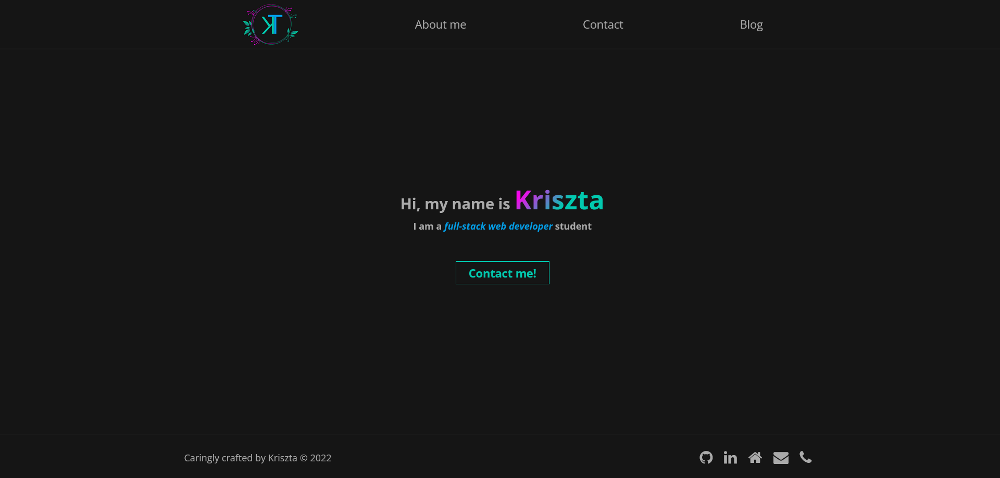
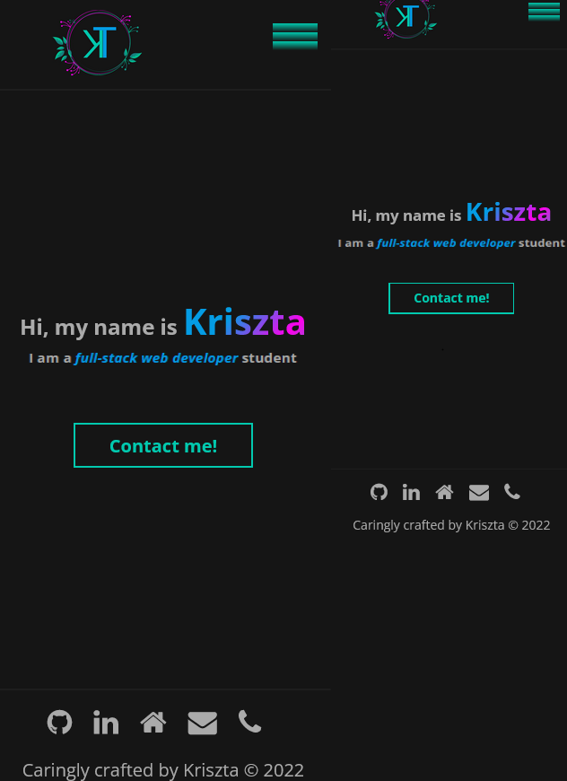
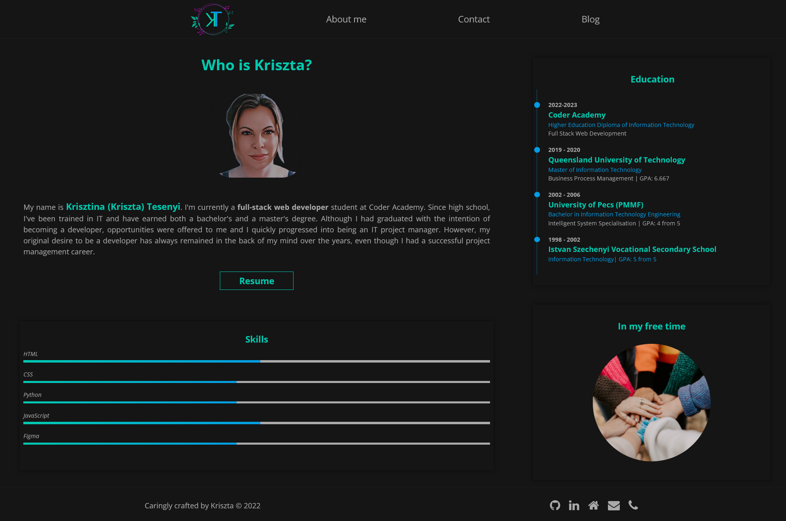
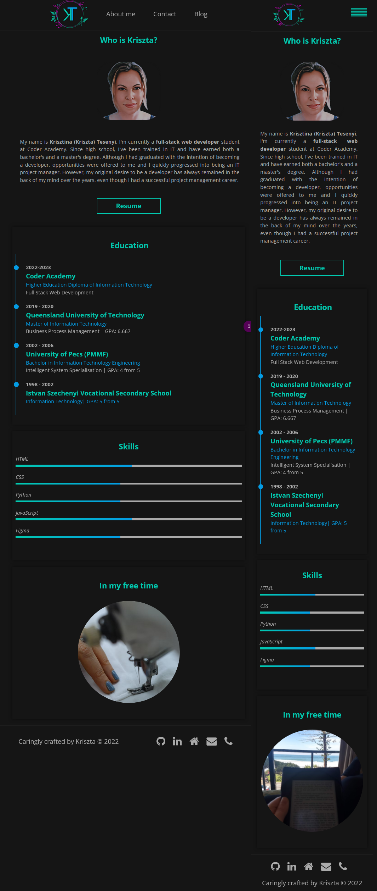
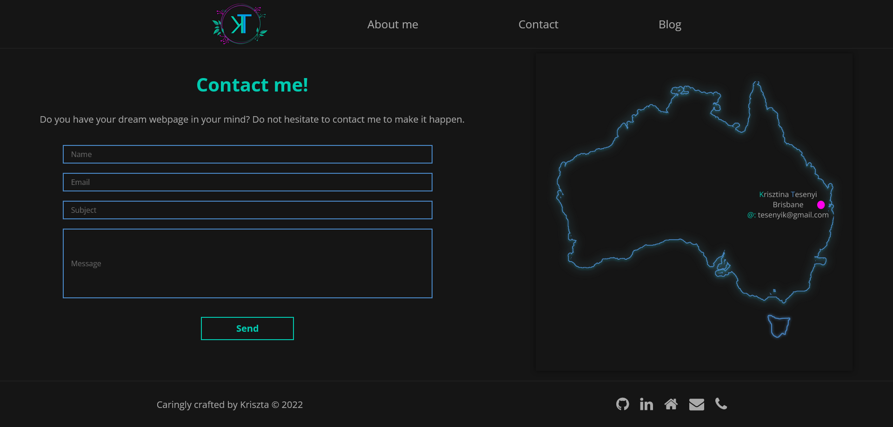
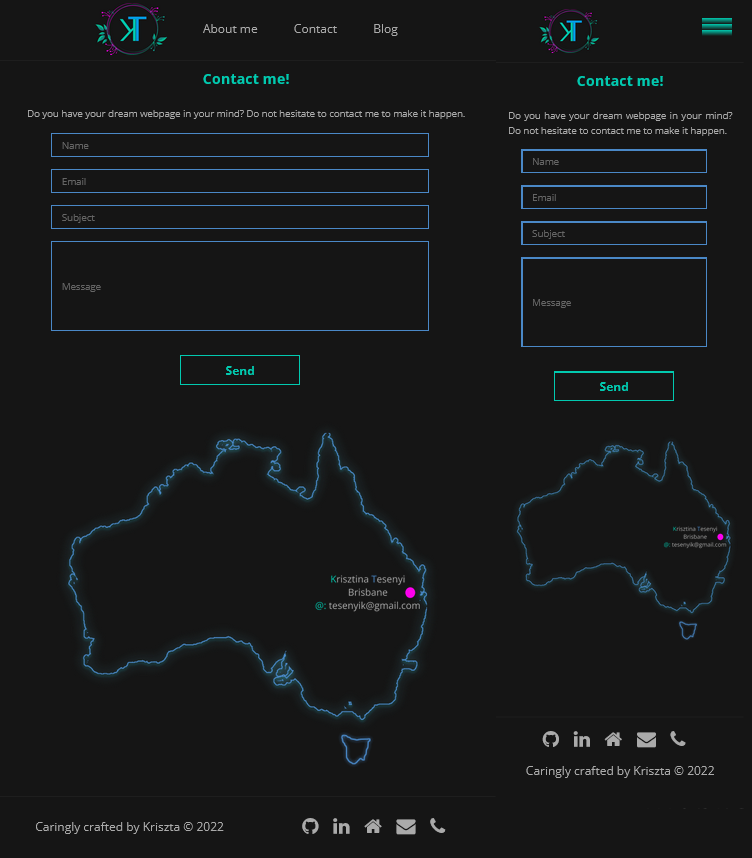
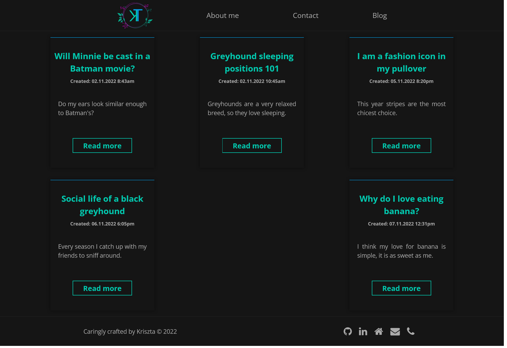
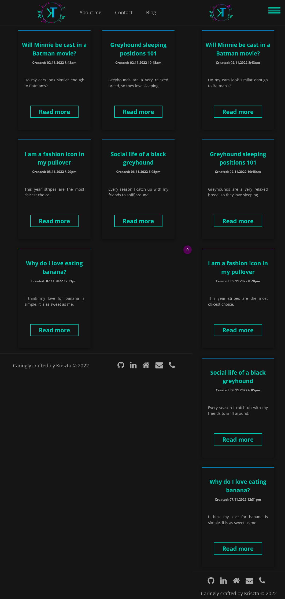
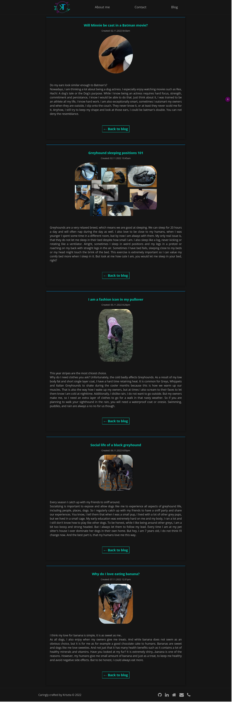
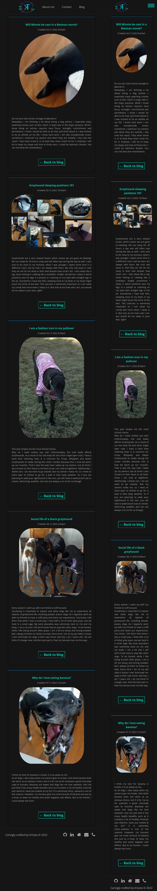

<!--General project documentation is to be compiled as a single markdown file named README.md. This file should contain,

A link (URL) to your published portfolio website
A link to your GitHub repo
Description of your portfolio website, including,
Purpose
Functionality / features
Sitemap
Screenshots
Target audience
Tech stack (e.g. html, css, deployment platform, etc)

-->
# Portfolio Website

[Portfolio website](https://)  
[GitHub](https://github.com/KrisztaT/portfolio)  
[Video Link](https://youtube.com)

## Purpose of the website

The website was created to showcase my ability to design, develop and deploy websites. Additionally, to provide information about me, including my skills, interests and knowledge.
It is important to show professionalism and high work ethics via the site to recruiters who have technical knowledge in the field.

## Target audience

My goal was to grab the attention of employers, who are looking for junior full-stack developers.

## Tech Stack

This portfolio website was built with:

* HTML

* CSS

* SASS-SCSS only.

**Wireframe** design: _Figma_  
**Sitemap**: _FigJam_  
**Code tracking**: _Git_  
**Online Git Repository**: _GitHub_ -[GitHub Repository Link](https://github.com/KrisztaT/portfolio)  
**README**: Markdown

## Functionality/Features

### Common functionality/features across the web pages

* Responsiveness: Flexbox and relative measures (such as rem, em, vw, wh, %) were utilised to achieve fully responsive layouts.

* Mobile first design: Throughout the sites media query definitions were used to adapt to different viewport sizes from mobile view.

```css
 /* As the screenshots below present the footer of the mobile and tablet-desktop view is different. Below code presents the desktop view, as the main scss body contains the mobile view */
@media screen and (min-width: 1025px) {

.footer {
    position:relative;
    bottom:0;
    width:100vw;
    height: 100px; 
    margin-top: auto;
    border-top: 2px solid $clr-cards;
    display: flex;
    flex-direction: row-reverse;
    justify-content: space-around;
    align-items: center; 
    color: $clr-general-txt;

    .foot-txt{
      text-align: left;
      
    }

  }
}
```

* Default values: Default values were defined and imported into the style.scss file (i.e.: background color, font sizes, font family [^1] button definitions etc.) to achieve consistent appearance and viewport-dependent design (such as bigger font sizes on desktop view etc.) through the pages.

* Navigation: The header contains the navigation bar to mobile (hamburger menu) and tablet-desktop view. The navigation is responding to hovering and clicking. The anchors provide a smooth journey to one page to another.

* Logo: Logo is an anchor to the home page. [^2]

* Buttons: All buttons upon hovering is responsive and change their color.

* Footer: The footer contains the social media, the home page, email me, and call me icons. [^3] All icons are linked to the appropriate websites, mail, and call service. All icons change color upon hovering for maximum effect.

## Sitemap


The index page is the landing/home page of the portfolio website, which the user sees upon loading the page. Thanks to the navigation in the header, which can be seen on the top of all sites, all pages can be accessed from another. The only exception is the Blog posts page, which is accessible from the blog.html site only.

## Screenshots

### Index.html

The index.html page is the landing/home page of the portfolio website, where I say Hi to the user.

### Index features

* My name is animated for full impact.

* The contact me button is also animated to catch the attention of the user.

* The contact me button is anchored to the contact.html page.

<br>

#### Index desktop view

<br>



#### Index tablet and mobile view  

<br>



### About.html

The about page's purpose is to provide information about who I am, my education, skills, and hobbies.

### About me features

* Resume button is linked to a mock resume.

* The education component is a timeline that shows my educational journey. Upon hovering over each individual school's card and the timeline indicator color change to highlight the information. This was created to engage the user while hovering over my web page.

* The skills component graphically provides information about my skill levels (Note: It's only mock-up data for assessment purposes, but I'll update as the course progresses and I learn more).

* The hobby card component is animated to show my different interest areas such as being with friends, sewing, hiking, or reading.

#### About me desktop view

<br>



#### About me tablet and mobile view

<br>



### Contact.html

The contact page’s purpose is to allow the user to send a message and inform them about my location, name, and email address. (Note: email and call icons can be found in the footer to give the user additional options for contact.)

### Contact me features

* Send button is animated to hook the user's focus.

* A form component was created to collect the information necessary for communication.

#### Contact me desktop view

<br>



#### Contact me tablet and mobile view

<br>



### Blog.html

The blog.html page lists all the blog posts I wrote about my dog, Minnie.

### Blog features

* Blog cards were created to list all the available blog posts.

* Upon hovering over the blog list card size increases, background and the border color of the card also change to engage the user.

* The titles of the blog card and the read more buttons are anchored to the blog post itself for easy navigation and reading experience

#### Blog desktop view

<br>



#### Blog tablet and mobile view

<br>



### Blog-posts.html

The blog-posts.html features all the blog posts I wrote about Minnie, my retired greyhound. I hope you'll enjoy reading about her quirks and learning a bit about sighthounds.

### Blog post features

* Blog postcards contain information about a given blog post.

* Every card includes a back-to-blog button, which is linked to the blog.html page.

#### Blog posts desktop view

<br>



#### Blog posts tablet and mobile view

<br>



# Reference

[^1]: [Open Sans Font-Google](https://fonts.google.com/specimen/Open+Sans?query=open+sans)
[^2]: [Canva](https://www.canva.com/)
[^3]: [Font Awesome Icons](https://fontawesome.com/v4/icons/)